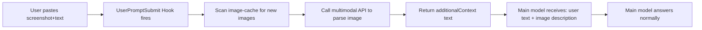

# CC-Vision

**English** · [简体中文](README_CN.md)

> Give a non-multimodal main model the ability to "see" pasted screenshots — a ~200-line Claude Code Hook.

## What it does

If you use Claude Code with a non-multimodal main model (GLM, DeepSeek, Qwen-Text, etc.), pasting a screenshot gets you a response like *"Please tell me what you'd like me to do"* — the model literally cannot see the image. The image content block is sent to the API and silently dropped.

This project solves it with a `UserPromptSubmit` hook: when the user pastes an image, the hook **automatically calls a multimodal model to parse the image into text** and injects that text into the main model's context. The main model stays cheap and fast — it just borrows eyes.



## Features

- **Non-invasive**: main model config untouched, just adds a hook
- **Any OpenAI-compatible multimodal API**: OpenAI / DashScope / Zhipu / SiliconFlow / Moonshot, etc.
- **Provider presets**: `VISION_PROVIDER=openai` fills in base_url + default model
- **Idempotent**: the same image is never parsed twice (tracked in `.vision-processed`)
- **Never blocks**: any crash returns `{}`, the conversation continues
- **Standalone test mode**: `--test-image` verifies API config without going through Claude Code

## Quick start

### 1. Configure API credentials

Export in your shell (or add to `~/.zshrc` / `~/.bashrc`):

```bash
# Option A: use a provider preset (fills base_url + default model)
export VISION_PROVIDER=openai
export VISION_API_KEY=sk-...
# VISION_MODEL is optional; preset sets a default. Override if you want:
# export VISION_MODEL=gpt-4o-mini

# Option B: fully custom
export VISION_API_BASE=https://api.openai.com/v1/chat/completions
export VISION_API_KEY=sk-...
export VISION_MODEL=gpt-4o
```

### 2. Install

```bash
git clone https://github.com/zhuqichen/CC-Vision.git
cd CC-Vision
./install.sh
```

`install.sh` will:
- Copy `image-vision.py` to `~/.claude/hooks/`
- Register the `UserPromptSubmit` hook in `~/.claude/settings.json` (idempotent — won't duplicate)

### 3. Verify config

```bash
python3 ~/.claude/hooks/image-vision.py --test-image /path/to/some/screenshot.png
```

You should see the API config + the image description.

### 4. Restart Claude Code

Open the `/hooks` menu once, or restart Claude Code, to load the new hook. Then paste a screenshot.

## Configuration

All via env vars — no code changes:

| Var | Default | Description |
|---|---|---|
| `VISION_PROVIDER` | (empty) | Provider preset: `openai` / `dashscope` / `zhipu` / `siliconflow` / `moonshot` |
| `VISION_API_BASE` | OpenAI official | Any OpenAI-compatible chat completions endpoint |
| `VISION_API_KEY` | **required** | API key |
| `VISION_MODEL` | `gpt-4o` | Multimodal model name |
| `VISION_EXTRA_HEADERS` | (empty) | JSON object string of extra request headers (e.g. for internal gateways) |
| `VISION_TIMEOUT` | `45` | Per-API-call timeout in seconds |
| `VISION_MAX_TOKENS` | `1200` | Max tokens for the parsed description |
| `VISION_RECENT_WINDOW` | `3600` | Only consider images modified within the last N seconds |

### Provider presets

| Provider | API_BASE | Default MODEL |
|---|---|---|
| `openai` | `https://api.openai.com/v1/chat/completions` | `gpt-4o` |
| `dashscope` | `https://dashscope.aliyuncs.com/compatible-mode/v1/chat/completions` | `qwen-vl-max` |
| `zhipu` | `https://open.bigmodel.cn/api/paas/v4/chat/completions` | `glm-4v-plus` |
| `siliconflow` | `https://api.siliconflow.cn/v1/chat/completions` | `Qwen/Qwen2-VL-72B-Instruct` |
| `moonshot` | `https://api.moonshot.cn/v1/chat/completions` | `moonshot-v1-8k-vision-preview` |

Need a new provider? Edit `PROVIDER_PRESETS` at the top of `image-vision.py` (PRs welcome).

## How it works

1. Claude Code caches pasted images to `~/.claude/image-cache/<session-id>/<n>.png`
2. User presses Enter, triggering the `UserPromptSubmit` hook
3. The script scans the cache dir for images that are "within the recent window AND not yet processed"
4. For each new image, it calls the multimodal API and gets a text description
5. All descriptions are wrapped in `<image_vision>...</image_vision>` and returned via `hookSpecificOutput.additionalContext`
6. Claude Code injects this text into the main model's current-turn context
7. The main model answers based on the text — it sees words, not pixels

### Idempotency

`~/.claude/image-cache/.vision-processed` records every image path that has been parsed. Each hook invocation reads this file and skips already-processed images.

Want to re-parse a specific image? Delete its line from that file. Want to re-parse everything? `rm ~/.claude/image-cache/.vision-processed`.

## Advanced

### Internal gateways / custom headers

If your API gateway needs extra headers (multi-tenant routing, etc.), use `VISION_EXTRA_HEADERS`:

```bash
export VISION_EXTRA_HEADERS='{"X-Model-Provider-Id": "tongyi", "X-Request-Source": "cc-vision-hook"}'
```

### Parallel multi-image parsing

Currently serial. If you often paste multiple images at once, swap the loop in `run_hook` for a `concurrent.futures.ThreadPoolExecutor` — PRs welcome.

### Portability

The same approach works in any AI terminal that supports a `UserPromptSubmit`-equivalent hook (Cursor, Cline, etc.). The script itself doesn't depend on Claude Code-specific APIs — any hook system that passes stdin JSON and reads stdout JSON works.

## FAQ

**Q: After install, pasting an image still does nothing?**
A: Three things to check:
1. Does `python3 ~/.claude/hooks/image-vision.py --test-image /path/to/img.png` work? If not → API config is wrong.
2. Have you restarted Claude Code or opened `/hooks` since installing? Config changes need a reload.
3. Check `~/.claude/image-cache/.vision-processed` — does it contain the path of the image you want? If yes → delete that line and retry.

**Q: How much does each image cost?**
A: Depends on the model. `gpt-4o` ~$0.01-0.03 per typical screenshot; `qwen-vl-max` and `glm-4v-plus` are similar; `gpt-4o-mini` is ~10x cheaper with slightly worse detail recognition.

**Q: Does it slow down the conversation?**
A: One image adds 1-3s of API latency. With no images, the hook returns near-instantly (early exit). Multiple images accumulate serially — switch to parallel if you need it.

**Q: Will the main model think the image description is user input?**
A: Yes, and that's the mechanism — the main model sees "the user described this image". The `<image_vision>` tag marks the source clearly; main models usually handle it correctly.

## License

MIT
