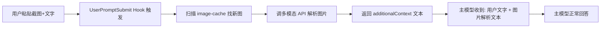

# CC-Vision

[English](README.md) · **简体中文**

> 让非多模态主力模型也能"看懂"截图：一个不到 200 行的 Claude Code Hook。

## 这是什么

如果你在 Claude Code 里用国产/开源模型（GLM、DeepSeek、Qwen-Text 等）做主力，粘截图会发现 AI 直接回「请告诉我您想做什么」——因为它根本看不见图。这类模型是**非多模态**的，图片消息块发过去等于石沉大海。

本项目的解决方案：写一个 `UserPromptSubmit` Hook，用户粘图时**自动调一个多模态模型把图解析成文字**，注入主模型上下文。主模型依然是你便宜好用的那个，眼睛是借来的。



## 特性

- **零侵入**：主模型配置不动，只加一个 hook
- **任意 OpenAI 兼容多模态 API**：OpenAI / 通义 / 智谱 / 硅基流动 / Moonshot 等
- **Provider 预设**：`VISION_PROVIDER=openai` 一行切换，自动填好 base_url 和默认模型
- **幂等**：同一张图不会重复花钱解析（`.vision-processed` 文件记录）
- **永不阻塞**：脚本崩溃也输出 `{}`，不影响正常对话
- **独立测试模式**：`--test-image` 直接验证 API 配置，不必走 Claude Code

## 快速开始

### 1. 配置 API 凭据

在 shell 里 `export`（推荐放进 `~/.zshrc` 或 `~/.bashrc`）：

```bash
# 方式 A：用 provider 预设（自动填 base_url + 默认模型）
export VISION_PROVIDER=openai
export VISION_API_KEY=sk-...
# VISION_MODEL 可选，预设已填默认值；要换就覆盖
# export VISION_MODEL=gpt-4o-mini

# 方式 B：完全自定义
export VISION_API_BASE=https://api.openai.com/v1/chat/completions
export VISION_API_KEY=sk-...
export VISION_MODEL=gpt-4o
```

### 2. 一键安装

```bash
git clone https://github.com/odebo/CC-Vision.git
cd CC-Vision
./install.sh
```

`install.sh` 会：
- 把 `image-vision.py` 拷到 `~/.claude/hooks/`
- 在 `~/.claude/settings.json` 的 `hooks.UserPromptSubmit` 注册（幂等，不会重复加）

### 3. 验证配置

```bash
python3 ~/.claude/hooks/image-vision.py --test-image /path/to/some/screenshot.png
```

正常会打印 API 配置 + 图片解析结果。

### 4. 重启 Claude Code

打开一次 `/hooks` 菜单或重启 Claude Code 让配置生效。然后粘张截图试试。

## 配置项

全部通过环境变量，无需改代码：

| 变量 | 默认值 | 说明 |
|---|---|---|
| `VISION_PROVIDER` | （空） | Provider 预设：`openai` / `dashscope` / `zhipu` / `siliconflow` / `moonshot` |
| `VISION_API_BASE` | OpenAI 官方 | 任何 OpenAI 兼容的 chat completions endpoint |
| `VISION_API_KEY` | **必填** | API key |
| `VISION_MODEL` | `gpt-4o` | 多模态模型名 |
| `VISION_EXTRA_HEADERS` | （空） | JSON 对象字符串，附加请求头（如内部网关的 provider 路由头） |
| `VISION_TIMEOUT` | `45` | 单次 API 调用超时秒数 |
| `VISION_MAX_TOKENS` | `1200` | 解析结果最大 token 数 |
| `VISION_RECENT_WINDOW` | `3600` | 只解析最近 N 秒内的新图，避免历史缓存被全扫 |

### Provider 预设对照

| Provider | API_BASE | 默认 MODEL |
|---|---|---|
| `openai` | `https://api.openai.com/v1/chat/completions` | `gpt-4o` |
| `dashscope` | `https://dashscope.aliyuncs.com/compatible-mode/v1/chat/completions` | `qwen-vl-max` |
| `zhipu` | `https://open.bigmodel.cn/api/paas/v4/chat/completions` | `glm-4v-plus` |
| `siliconflow` | `https://api.siliconflow.cn/v1/chat/completions` | `Qwen/Qwen2-VL-72B-Instruct` |
| `moonshot` | `https://api.moonshot.cn/v1/chat/completions` | `moonshot-v1-8k-vision-preview` |

要加新 provider？编辑 `image-vision.py` 顶部的 `PROVIDER_PRESETS` 字典即可（欢迎提 PR）。

## 工作原理

1. Claude Code 把粘贴的图片缓存到 `~/.claude/image-cache/<session-id>/<n>.png`
2. 用户按回车，触发 `UserPromptSubmit` hook
3. 脚本扫描缓存目录，找出"最近 1 小时内 + 未解析过"的图片
4. 对每张图调多模态 API，拿到文字描述
5. 把所有描述拼成 `<image_vision>...</image_vision>` 块，通过 `hookSpecificOutput.additionalContext` 返回
6. Claude Code 把这段文本注入主模型本轮上下文
7. 主模型据此回答——它看到的不是像素，是文字

### 幂等机制

`~/.claude/image-cache/.vision-processed` 文件记录所有已解析过的图片绝对路径。每次 hook 触发都会读这个文件跳过已处理的图。

想重新解析某张图？从该文件删掉对应行即可。想全部重解析？`rm ~/.claude/image-cache/.vision-processed`。

## 高级用法

### 内部网关 / 自定义请求头

如果你的 API 网关需要额外 header（比如多租户路由头），用 `VISION_EXTRA_HEADERS`：

```bash
export VISION_EXTRA_HEADERS='{"X-Model-Provider-Id": "tongyi", "X-Request-Source": "cc-vision-hook"}'
```

### 多图并发

当前是串行调用。如果你常一次粘多图，可以用 `concurrent.futures.ThreadPoolExecutor` 改造 `run_hook` 里的循环——欢迎提 PR。

### 跨平台

这套思路在任何支持 `UserPromptSubmit` hook 的 AI 终端上都能用（Cursor、Cline 等同类机制）。脚本本身不依赖 Claude Code 特定 API，只要 hook 系统能传 stdin JSON、读 stdout JSON 即可。

## 常见问题

**Q: 安装后粘图还是没反应？**
A: 三步排查：
1. `python3 ~/.claude/hooks/image-vision.py --test-image /path/to/img.png` 能不能跑通？不能→API 配置错。
2. 重启过 Claude Code 或打开过 `/hooks` 菜单吗？配置变更需要重新加载。
3. 看 `~/.claude/image-cache/.vision-processed` 里有没有你想解析的那张图？有→删掉对应行重试。

**Q: 每张图大概花多少钱？**
A: 取决于模型。`gpt-4o` 一张普通截图约 1-3 分美元；`qwen-vl-max`、`glm-4v-plus` 量级相近；`gpt-4o-mini` 便宜 10 倍但细节识别略差。

**Q: 会拖慢对话吗？**
A: 一张图加 1-3 秒 API 调用。无图时 hook 几乎瞬时返回（早退）。多图串行会累积，可自行改并发。

**Q: 主模型会不会以为图片解析文本是用户输入的？**
A: 会，但这正是机制本身——主模型看到的就是"用户描述了这张图"。`<image_vision>` 标签是为了在上下文里清晰标记这段文本的来源，主模型通常能正确识别。

## 许可证

MIT
